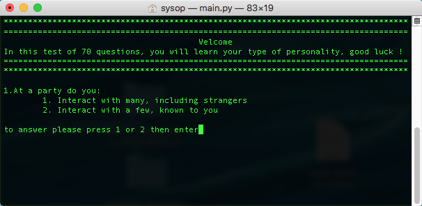

# MBTI_personality_16_tester
Based on the work of Harley Friedman, if you want to know which one of the 16 personalities you are, pass this test

## You can run this script using python 3, you can also run it online, just copy the contain of "main.py" file, go to https://www.onlinegdb.com/online_python_compiler paste the code, then run it.

## You can learn more about the personality type you got on the test by the pdf included in this repository.
